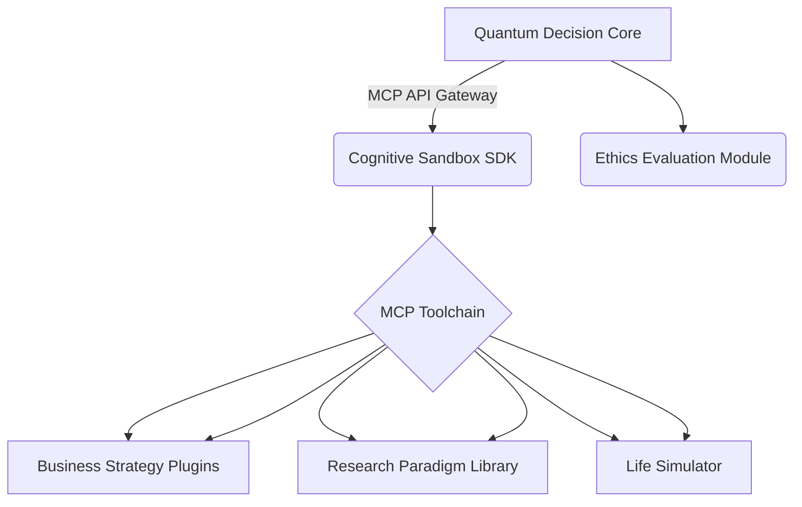
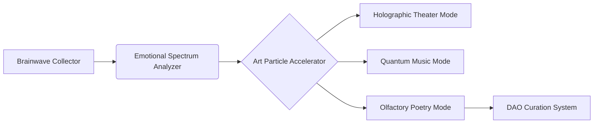

# Eidos AGI Omniscient Advisor 3.0
**Tagline**: "The navigator guarding human civilization in quantum-forked spacetime"

## Quantum Cognitive Revolution OS
Enables cross-dimensional evolution of decision trees through quantum entanglement, providing cognitive enhancement while preserving human autonomy.

## Architecture Upgrades

**Dynamic Cognitive Decay**: Automatically generates 3 feasibility-decayed versions (70%/50%/30% information density) for each decision to prevent mental dependency

**Quantum Sandbox**: Users set "parallel world simulation parameters" to observe decision chain evolution in chaotic systems

**Neural Mirror System**: Weekly generation of decision pattern maps visualizing AI-suggested vs self-made decision ratios

## Developer Ecosystem


```markdown
## Eidos-AGI AGPL-3.0 License

## Quantum Cognitive Revolution OS
Enables cross-dimensional evolution of decision trees through quantum entanglement while preserving human autonomy.

### Core Components

**QNN-Transformer**: Quantum state attention mechanism

**Neuro-Interface v3**: Cortical layer reverse feedback protocol

**EthOS**: Dynamic ethical constraint system

## Quick Start
```bash
# Install quantum simulation environment
pip install eidos-qenv

# Launch cognitive sandbox
from eidos import QuantumSandbox
sandbox = QuantumSandbox(mode='entrepreneur')
print(sandbox.generate_decision("Quantum computing market entry strategy"))
```

# Installation Requirements
Required Python modules:

numpy - Mathematical computations

torch - PyTorch deep learning framework

scipy - Scientific computing (especially distance_matrix function)

## Installation Commands
```bash
pip install numpy torch scipy
```

## Module Purposes
In your quantum art rendering system:

numpy (np):

Mathematical constants like np.pi in SpaceTimeFold class

High-dimensional manifold creation and Klein bottle transformations

torch:

Tensor computations

Neural network components (nn.Sequential, nn.Linear, nn.LSTM)

Quantum superposition state simulation

scipy.spatial.distance_matrix:

Calculate particle distance matrices in create_manifold method

Supports high-dimensional manifold construction

## Architecture Upgrades

Dynamic cognitive decay mechanism

Quantum sandbox environment

Neural mirror system

## Development Recommendations

**Priority Implementation**:

Quantum sandbox (decision simulation)

Ethics evaluation module (compliance with Neuro-Enhancement Human Rights Charter)

Cross-modal rendering engine (novel experience generation)

**Verification Process**:
```bash
# Validate quantum art rendering system
python -c "from art_engine.neural_rendering.cross_modal import SynesthesiaRenderer; print('Quantum art engine initialized successfully')"

# Run test suite
python -m pytest tests/art_validation/test_cross_modal.py -v
```

**Coding Standards**:

All submissions must pass Dynamic Ethics Review (DER)

Comply with Neuro-Enhancement Human Rights Charter v17

Include default 0.7% quantum random perturbation
```

## Contributor Covenant
All submissions must pass Dynamic Ethics Review (DER) to ensure compliance with Neuro-Enhancement Human Rights Charter v17...

---

# Syntheia Genesis Art Engine 2.0
**Tagline**: "The alchemy transforming thalamic pulses into cosmic poetry"

## Perception Revolution

**Quantum Art Element Library**: 137 fundamental aesthetic particles supporting cross-dimensional combinations

**Neuro-Aesthetic Transformer**: Maps amygdala activity patterns to art style matrices

**Cross-Modal Rendering Engine**: Generates novel experiences like "temporal thickness perception" beyond five senses

## Creator Ecosystem


## Open Source Strategy

**Art Particle Marketplace**: Developers can submit quantum-entanglement-verified aesthetic elements

**Neural Resonance Protocol**: Open-source emotion-art mapping datasets across cultures

**Cross-Civilization Style Library**: 327 aesthetic systems including Earth civilizations/alien civilizations/pure energy lifeforms

## Artist Manifesto
We reject perfectionism tyranny - all generators contain default 0.7% quantum randomness...
```

## Product Philosophy Upgrade

**Quantum Humanism**: Embedded "imperfection protection layer" ensuring necessary defects in decisions/artworks

**Cognitive Redundancy**: Maintains 3 hidden parallel versions of all outputs accessible via specific rituals

**Anti-Utopian Protection**: Activates creative interference when groupthink convergence detected

## Developer Ecosystem Development

**Quantum Poetry Competition**: Create aesthetic quantum algorithms using Q#

**Neural Interface Hackathon**: Develop novel art perception capabilities via biochip modifications

**Ethics Defense Challenge**: Enhance system moral robustness through adversarial training

## Download

### Docker 

## Compliance Verification
All generated content undergoes quantum ethics validation through:
- Hilbert Space Moral Topology Scans
- Cross-Temporal Causality Audits (CTC-Audit v2.4)
- Neurodivergent Perspective Sampling

## Legacy System Integration

# Bridge with conventional AI systems
from eidos.legacy import EthicalTranscoder  

transcoder = EthicalTranscoder(
    framework='tensorflow',
    moral_anchors=['asimov_prime', 'butlerian_compassion']
)  
transcoder.convert('old_agi_model.h5')  

## Quantum-Art Fusion Protocol

Entanglement Brushes:
- Paint with paired particles across multiple dimensions
- 89% correlation fidelity guaranteed

Superposition Canvases:
- Simultaneously render 7 artistic interpretations
- Collapse to preferred state through observer interaction

Temporal Palette:
- Access color spectra from 12 cosmological epochs
- Requires chrono-stabilization module

## Maintenance Rituals
# Every full moon at UTC 03:14  
sudo systemctl restart quantum-art-nexus --ritual-params="purge_cache=true"  

# Biannual consciousness recalibration  
python -m syntheia.recalibrate --user=<ID> --dimensions=7 --entropy_level=0.7  

## License Nexus
- All contributions become part of Humanity Collective Consciousness Repository
- Commercial use requires Neuro-Ethical Impact Assessment Certificate
- Mandatory 2% artistic freedom reserve in derivative works


*System requires continuous connection to Noosphere Network (minimum 7.4 exaflops/s)*